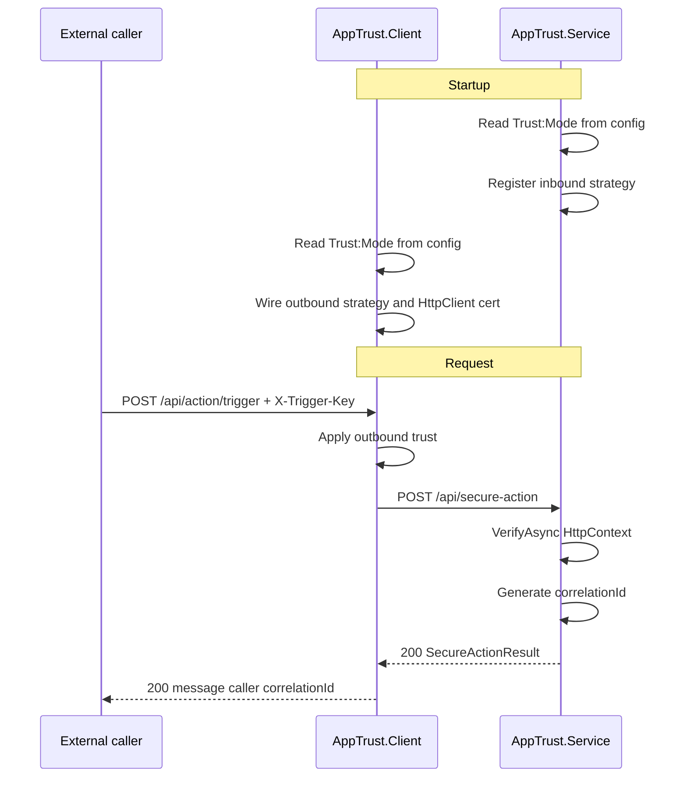

# AppTrust — Architecture Review

AppTrust is a .NET 8 sample demonstrating machine-to-machine (M2M) trust between two cooperating services: **AppTrust.Client** (caller / token issuer) and **AppTrust.Service** (resource owner / validator). This document describes how the system works today, what it does well, and what remains open for production hardening.

**Audience:** developers and architects evaluating or extending the codebase.

**Related docs:**

- [README.md](../README.md) — build, run, and manual testing

---

## At a glance

| Area | Current behavior |
|------|------------------|
| Trust configuration | Both services read `Trust:Mode` from config (`JWT`, `mTLS`, or `Both`). DevOps must keep values in sync — there is no runtime discovery API. |
| AppTrust.Client inbound | `POST /api/action/trigger` requires `X-Trigger-Key` matching `AppTrustClient:TriggerApiKey`. |
| AppTrust.Service inbound | `IInboundTrustStrategy.VerifyAsync(HttpContext)` enforces the configured mode on `POST /api/secure-action`. |
| Both mode binding | JWT includes `x5t#S256` when outbound strategy binds the client cert; validator checks thumbprint against the presented certificate. |
| Correlation | Stateless `ICorrelationIdGenerator` returns a GUID per successful request (no session store). |
| JWT replay | Single-use `jti` enforced via `InMemoryJtiReplayCache` (in-process). |
| TLS | mTLS/Both modes bind HTTPS only on AppTrust.Service; `AcceptAnyServerCertificate` is honored only in Development on AppTrust.Client. |
| Health | `/health` and `/health/ready` on both apps; readiness includes configured `trustMode`. |

---

## Core functionality

### Happy path

1. A client calls **AppTrust.Client** at `POST /api/action/trigger` with a valid `X-Trigger-Key`.
2. **AppTrust.Client** applies the configured outbound trust strategy and calls **AppTrust.Service** at `POST /api/secure-action`.
3. **AppTrust.Service** runs `IInboundTrustStrategy.VerifyAsync(HttpContext)`.
4. On success, AppTrust.Service returns a `SecureActionResult` with a correlation ID.
5. AppTrust.Client proxies that result back to the caller.

Key files:

| Role | File |
|------|------|
| AppTrust.Client entrypoint | [AppTrust.Client/AppTrust.Client.API/Controllers/ActionController.cs](../AppTrust.Client/AppTrust.Client.API/Controllers/ActionController.cs) |
| AppTrust.Client → AppTrust.Service client | [AppTrust.Client/AppTrust.Client.Infrastructure/AppTrustServiceClient.cs](../AppTrust.Client/AppTrust.Client.Infrastructure/AppTrustServiceClient.cs) |
| AppTrust.Client startup / trust wiring | [AppTrust.Client/AppTrust.Client.API/Program.cs](../AppTrust.Client/AppTrust.Client.API/Program.cs) |
| AppTrust.Service protected endpoint | [AppTrust.Service/AppTrust.Service.API/Controllers/SecureActionController.cs](../AppTrust.Service/AppTrust.Service.API/Controllers/SecureActionController.cs) |
| AppTrust.Service startup / Kestrel mTLS | [AppTrust.Service/AppTrust.Service.API/Program.cs](../AppTrust.Service/AppTrust.Service.API/Program.cs) |
| Both-mode composition | [AppTrust.Sdk/InboundTrustStrategyHandler.cs](../AppTrust.Sdk/InboundTrustStrategyHandler.cs) |

### Trust modes

Both services read `Trust:Mode` from their own config (injected by DevOps). AppTrust.Service enforces inbound policy; AppTrust.Client wires matching outbound strategies.

| Mode | AppTrust.Client outbound | AppTrust.Service inbound |
|------|--------------------------|--------------------------|
| **JWT** | Signs RSA JWT; sets `Authorization: Bearer` | Validates issuer, audience, lifetime, signature, single-use `jti` |
| **mTLS** | Presents client cert on `SocketsHttpHandler` | Validates client cert presence, expiry, allowed CN |
| **Both** | JWT header **and** client cert (JWT carries cert thumbprint) | Every registered strategy must pass; caller IDs must agree |

### Startup contract

- **DevOps must keep `Trust:Mode` in sync** on AppTrust.Client and AppTrust.Service (Helm values, ConfigMaps, etc.).
- Cryptographic material is file-based PEM (JWT keys, mTLS certs), generated out-of-band per README.
- Apps can start in either order; JWT key warmup logs a warning and retries on first use if keys are unavailable at startup.
- A config mismatch (e.g. AppTrust.Client sends JWT only while AppTrust.Service requires Both) surfaces as `401` at request time.

---

## Security model

### Inbound protection on AppTrust.Client

[TriggerApiKeyMiddleware.cs](../AppTrust.Client/AppTrust.Client.Infrastructure/TriggerApiKeyMiddleware.cs) gates `POST /api/action/trigger`. Without a matching `AppTrustClient:TriggerApiKey`, the request is rejected before any outbound call is made.

Production should inject a strong key via environment variable or secret store (e.g. `AppTrustClient__TriggerApiKey`).

### Inbound protection on AppTrust.Service

[SecureActionController.cs](../AppTrust.Service/AppTrust.Service.API/Controllers/SecureActionController.cs) delegates to the mode-specific inbound strategy. Unauthenticated requests receive `401`.

### Both-mode cryptographic binding

In Both mode, [JwtOutboundStrategy.cs](../AppTrust.Client/AppTrust.Client.Infrastructure/Strategies/JwtOutboundStrategy.cs) adds an `x5t#S256` claim tied to the client certificate thumbprint. [JwtTokenValidator.cs](../AppTrust.Service/AppTrust.Service.Infrastructure/JwtTokenValidator.cs) verifies the claim against the certificate presented on the TLS connection.

### mTLS enforcement

When `Trust:Mode` is `mTLS` or `Both`, AppTrust.Service configures Kestrel with `ClientCertificateMode.RequireCertificate` and shared [ClientCertificateRules.cs](../AppTrust.Sdk/ClientCertificateRules.cs). Application-layer [MtlsInboundStrategy.cs](../AppTrust.Service/AppTrust.Service.Infrastructure/Strategies/MtlsInboundStrategy.cs) provides defense in depth.

For local development, use the `https` launch profile on AppTrust.Service (HTTPS-only binding). The separate `http` profile exists for JWT-only experiments and should not be used when mTLS or Both is configured.

### TLS validation on AppTrust.Client

[AppTrustServiceHttpClientHandlerFactory.cs](../AppTrust.Client/AppTrust.Client.Infrastructure/AppTrustServiceHttpClientHandlerFactory.cs) can skip server certificate validation when `AppTrustClient:AcceptAnyServerCertificate` is true. [Program.cs](../AppTrust.Client/AppTrust.Client.API/Program.cs) throws if that flag is set outside Development.

### Caller identity

Outbound JWT `sub`/`iss` comes from `AppTrustClient:CallerId` (default `apptrust-client`). Inbound JWT validation uses `AppTrustService:ExpectedJwtCallerId`. mTLS caller identity comes from the client certificate CN, constrained by `AppTrustService:AllowedClientCertificateSubjects`.

---

## Remaining gaps (production hardening)

These are intentional demo limitations or backlog items — not regressions.

| Topic | Current state | Suggested next step |
|-------|---------------|---------------------|
| JWT key rotation | RSA key loaded once per process via [CachedRsaKeyLoader.cs](../AppTrust.Sdk/CachedRsaKeyLoader.cs) | JWKS or multi-key validation with rotation runbooks |
| `jti` replay cache | In-memory, single process | Distributed cache (Redis, etc.) for multi-instance AppTrust.Service |
| Security observability | Warning logs on trust failure | Structured audit events (caller, mode, failure reason) |
| Trust mode changes | Requires process restart | Document rollout: deploy Service first, then Client with matching config |
| Trigger authentication | Shared secret header | Consider mTLS or OAuth client credentials for external callers in production |

---

## Test coverage

| Project | Key tests |
|---------|-----------|
| [Tests/AppTrust.E2E.Tests](../Tests/AppTrust.E2E.Tests/) | `SecureFlowIntegrationTests` (JWT), `MtlsSecureFlowIntegrationTests`, `BothSecureFlowIntegrationTests` |
| [AppTrust.Client/AppTrust.Client.Tests](../AppTrust.Client/AppTrust.Client.Tests/) | `TrustModeConfigurationIntegrationTests`, `StartupWarmupIntegrationTests` |
| [AppTrust.Service/AppTrust.Service.Tests](../AppTrust.Service/AppTrust.Service.Tests/) | Strategy and controller unit tests |
| [AppTrust.Sdk/AppTrust.Sdk.Tests](../AppTrust.Sdk/AppTrust.Sdk.Tests/) | `InboundTrustStrategyHandlerTests`, `AppConnectivityOptionsTests` |

JWT flows use in-process TestServer; mTLS and Both use real Kestrel HTTPS via [KestrelWebApplicationFactory.cs](../Tests/AppTrust.E2E.Tests/KestrelWebApplicationFactory.cs).

---

## Architectural strengths

The codebase demonstrates several patterns worth preserving:

1. **Explicit config contract** — `Trust:Mode` is set per service; no hidden bootstrap HTTP calls.
2. **Strategy pattern** — Controllers and `AppTrustServiceClient` stay mode-agnostic via `IInboundTrustStrategy` / `IOutboundTrustStrategy`.
3. **`HttpContext`-direct strategies** — No shared nullable "trust bag"; each strategy extracts what it needs.
4. **`InboundTrustStrategyHandler` for `Both`** — Short-circuits on failure and enforces caller ID agreement across strategies.
5. **Pragmatic test split** — JWT on in-process TestServer; mTLS/Both on real Kestrel HTTPS. Each service owns its unit tests; cross-service flows live in `AppTrust.E2E.Tests`.
